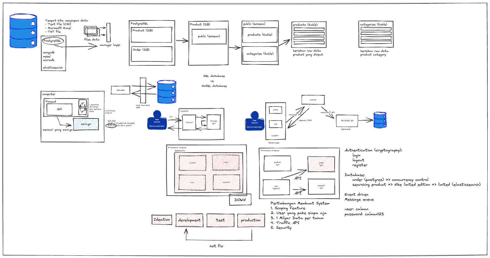

# WORKSHOP GOLANG

## Table of Contents

- [About](#about)
- [Getting Started](#getting_started)

## About <a name = "about"></a>

Project materi workshop golang yang mencakup pembahasan:
1. Database
2. Golang CLI
3. ORM
4. API
5. Misc mengenai microservice

## Getting Started <a name = "getting_started"></a>

Untuk memulai menjalankan project ini, perhatikan section pada `main.go`. 
Setiap section memiliki alur yang berbeda, sehingga jika ingin menjalankan section, bisa di comment section lainnya terlebih dahulu. 

OVERVIEW WORKSHOP:


### Prerequisites

Untuk menjalankan project ini diperlukan program yang terinstall:
1. PostgreSQL
2. Golang
3. VSCode

### Installing

Untuk menjalankan project ini, cukup menjalankan perintah dibawah ini terlebih dahulu

```
go mod tidy
```

Untuk memberikan input pada program bisa memberikan `-name` atau `-category_id` pada golang CLI

```
go run main.go -name=calman
or
go run main.go -category_id=1
```

Untuk menjalankan API, jalankan pada section 5, lalu buka browser dan arahkan ke
```
http://127.0.0.1:9091/product?id=1
```